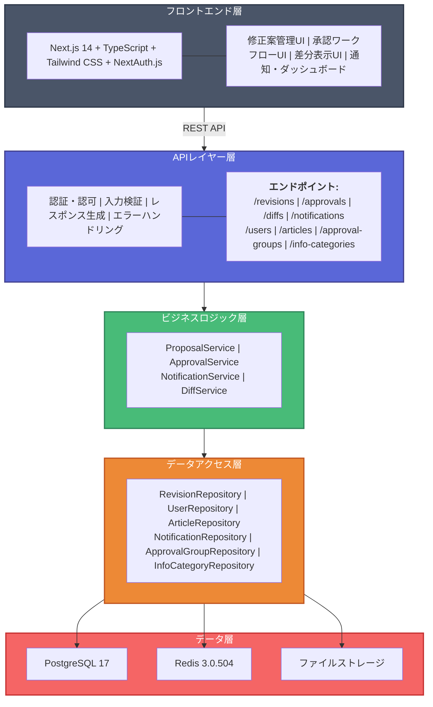
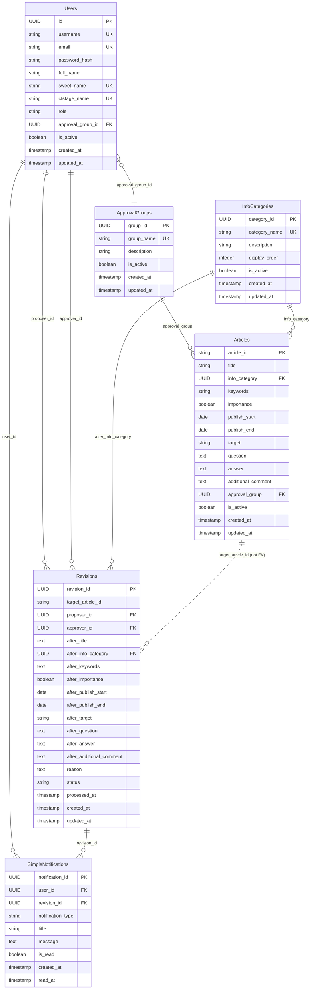

# 詳細設計書 - ナレッジ修正案承認システム

## 1. アーキテクチャ概要

### 1.1 システム構成図



### 1.2 技術スタック（実装済み）

**バックエンド**:
- 言語: Python 3.12+
- フレームワーク: FastAPI 0.115.8
- ORM: SQLAlchemy 2.0.40 + Alembic
- データベース: PostgreSQL 17, Redis 3.0.504
- 認証: python-jose + passlib + bcrypt
- テスト: pytest + pytest-asyncio + fakeredis
- 依存関係管理: uv

**フロントエンド**:
- 言語: TypeScript 5.0+
- フレームワーク: React 18 + Next.js 14
- 認証: NextAuth.js
- UI: Tailwind CSS + Shadcn/ui
- 差分表示: react-diff-viewer
- バリデーション: Zod

## 2. データベース設計（実装済み）

### 2.1 エンティティ関係図



### 2.2 テーブル定義（実装済み）

#### users テーブル
```sql
CREATE TABLE users (
    id UUID PRIMARY KEY DEFAULT uuid_generate_v4(),
    username VARCHAR(50) UNIQUE NOT NULL,
    email VARCHAR(255) UNIQUE NOT NULL,
    password_hash VARCHAR(255) NOT NULL,
    full_name VARCHAR(100) NOT NULL,
    sweet_name VARCHAR(50) UNIQUE,
    ctstage_name VARCHAR(50) UNIQUE,
    role VARCHAR(20) NOT NULL DEFAULT 'user',
    approval_group_id UUID REFERENCES approval_groups(group_id) ON DELETE SET NULL,
    is_active BOOLEAN NOT NULL DEFAULT true,
    created_at TIMESTAMP WITH TIME ZONE DEFAULT CURRENT_TIMESTAMP,
    updated_at TIMESTAMP WITH TIME ZONE DEFAULT CURRENT_TIMESTAMP
);
```

#### revisions テーブル（核心部分）
```sql
CREATE TABLE revisions (
    revision_id UUID PRIMARY KEY DEFAULT uuid_generate_v4(),
    target_article_id VARCHAR(100) NOT NULL,  -- 柔軟性のためFKではない
    proposer_id UUID NOT NULL REFERENCES users(id) ON DELETE CASCADE,
    
    -- After-only フィールド（全てnullable）
    after_title TEXT,
    after_info_category UUID REFERENCES info_categories(category_id) ON DELETE SET NULL,
    after_keywords TEXT,
    after_importance BOOLEAN,
    after_publish_start DATE,
    after_publish_end DATE,
    after_target VARCHAR(100),
    after_question TEXT,
    after_answer TEXT,
    after_additional_comment TEXT,
    
    -- メタデータ
    reason TEXT NOT NULL,
    status VARCHAR(20) NOT NULL DEFAULT 'draft',
    approver_id UUID NOT NULL REFERENCES users(id) ON DELETE CASCADE,  -- 必須
    processed_at TIMESTAMP WITH TIME ZONE,
    
    created_at TIMESTAMP WITH TIME ZONE DEFAULT CURRENT_TIMESTAMP,
    updated_at TIMESTAMP WITH TIME ZONE DEFAULT CURRENT_TIMESTAMP
);
```

### 2.3 重要な設計方針

#### After-only設計
- **修正前データは保持しない**: 元データは articles テーブルから取得
- **修正後データのみ保存**: revisions テーブルの after_* フィールド
- **差分表示**: 現在値（article）vs 提案値（revision）で動的生成

#### 承認者事前指定
- **approver_id が必須**: 修正案作成時に承認者を指定
- **責任の明確化**: 誰が承認するかが事前に決定
- **通知の効率化**: 適切な承認者にのみ通知

## 3. API設計（実装済み）

### 3.1 API設計詳細

**詳細なAPI仕様は別ファイルを参照**: `api_design.md`

主要エンドポイント:
- 修正案管理: `/api/v1/revisions/*`
- 承認管理: `/api/v1/approvals/*`
- 差分表示: `/api/v1/diffs/*`
- ユーザー管理: `/api/v1/users/*`
- その他管理系: `/api/v1/articles/*`, `/api/v1/approval-groups/*`, etc.

### 3.2 認証・認可（実装済み）

#### JWT トークンベース認証
```python
# 依存関数による権限チェック
get_current_active_user()      # 認証済みアクティブユーザー
get_current_approver_user()    # 承認者権限チェック
get_current_admin_user()       # 管理者権限チェック
```

#### 権限ベースアクセス制御
- **一般ユーザー**: 自分の修正案のみ操作可能
- **承認者**: 担当グループの修正案承認可能 + 自分の修正案操作
- **管理者**: 全修正案の操作・閲覧可能

## 4. ビジネスロジック設計（実装済み）

### 4.1 サービスクラス構成

#### ProposalService（修正案サービス）
```python
class ProposalService:
    async def create_proposal(self, db: AsyncSession, *, proposal_data: RevisionCreate, proposer: User, approver_id: UUID) -> Revision:
        """修正案作成（approver_id必須）"""
        
    async def submit_proposal(self, db: AsyncSession, *, revision_id: UUID, proposer: User) -> Revision:
        """修正案提出（draft → submitted）"""
        
    async def withdraw_proposal(self, db: AsyncSession, *, revision_id: UUID, proposer: User) -> Revision:
        """修正案撤回（submitted → draft）"""
        
    async def update_proposal(self, db: AsyncSession, *, revision_id: UUID, update_data: RevisionUpdate, proposer: User) -> Revision:
        """修正案更新（draft状態のみ）"""
        
    async def validate_at_least_one_change(self, proposal_data: RevisionCreate, article: Article) -> bool:
        """少なくとも1つの変更があることを検証"""
```

#### ApprovalService（承認サービス）
```python
class ApprovalService:
    async def process_approval_decision(self, db: AsyncSession, *, revision_id: UUID, approver: User, decision: ApprovalDecision) -> Revision:
        """承認・却下処理"""
        
    async def can_user_approve(self, revision: Revision, user: User) -> bool:
        """ユーザーが承認可能かチェック"""
        
    async def get_approval_queue(self, db: AsyncSession, *, approver: User) -> List[Revision]:
        """承認待ち一覧取得"""
```

#### DiffService（差分サービス）
```python
class DiffService:
    async def generate_field_diff(self, db: AsyncSession, *, revision: Revision) -> Dict[str, FieldDiff]:
        """フィールドレベル差分生成"""
        
    async def preview_changes(self, db: AsyncSession, *, revision_id: UUID) -> Dict[str, Any]:
        """プレビュー用データ生成"""
```

### 4.2 ステータス遷移（実装済み）

```
draft ──┐
        │ submit_proposal()
        ▼
    submitted ──┐
        │       │ approve_proposal()
        │       ├─────────────────► approved
        │       │ reject_proposal()
        │       ├─────────────────► rejected  
        │       │ delete_proposal() (admin only)
        │       └─────────────────► deleted
        │ withdraw_proposal()
        ▼
    draft ◄─────┘
```

## 5. フロントエンド設計

### 5.1 コンポーネント構成

```
/src
├── components/
│   ├── revision/
│   │   ├── revision-list.tsx          # 修正案一覧
│   │   ├── revision-form.tsx          # 修正案作成・編集フォーム
│   │   ├── revision-detail.tsx        # 修正案詳細表示
│   │   └── revision-status-badge.tsx  # ステータスバッジ
│   ├── approval/
│   │   ├── approval-queue.tsx         # 承認待ち一覧
│   │   ├── approval-form.tsx          # 承認・却下フォーム
│   │   └── approval-history.tsx       # 承認履歴
│   ├── diff/
│   │   ├── field-diff.tsx            # フィールド差分表示
│   │   ├── diff-viewer.tsx           # 統合差分ビューアー
│   │   └── change-summary.tsx        # 変更サマリー
│   └── common/
│       ├── data-table.tsx            # 汎用テーブル
│       ├── status-filter.tsx         # ステータスフィルター
│       └── permission-guard.tsx      # 権限制御コンポーネント
```

### 5.2 画面設計

#### メイン画面
- **ダッシュボード**: 自分の修正案・承認待ち案件の概要
- **修正案一覧**: 権限に応じた修正案の表示・検索・フィルタリング
- **修正案詳細**: 修正案の詳細情報と差分表示
- **承認キュー**: 承認待ち案件の一覧（承認者のみ）

#### データフロー
```
ユーザー操作
    ↓
Reactコンポーネント
    ↓
API Client (axios)
    ↓
FastAPI エンドポイント
    ↓
ビジネスロジック（Service）
    ↓
データアクセス（Repository）
    ↓
データベース（PostgreSQL）
```

## 6. セキュリティ設計（実装済み）

### 6.1 認証・認可フロー
```
1. ユーザーログイン → JWT トークン発行
2. API リクエスト → JWT トークン検証
3. 権限チェック → ロール・承認グループベース制御
4. リソースアクセス → 個別権限チェック
```

### 6.2 データ保護
- **入力検証**: Pydantic スキーマによる厳格な検証
- **SQL インジェクション対策**: SQLAlchemy ORM使用
- **XSS対策**: フロントエンド側でのサニタイゼーション
- **CSRF対策**: トークンベース認証で防止

## 7. パフォーマンス設計

### 7.1 データベース最適化（実装済み）
- **適切なインデックス**: 検索頻度の高いカラムにインデックス設定
- **クエリ最適化**: SQLAlchemy によるN+1問題対策
- **コネクションプール**: 非同期接続プールによる効率化

### 7.2 Redis活用（制約対応）
```python
# Redis 3.0.504 で利用可能な機能のみ使用
- 基本操作: SET, GET, DEL, EXPIRE
- Hash操作: HSET, HGET, HDEL  
- List操作: LPUSH, RPUSH, LPOP, RPOP
- 使用用途: セッション、カウンター、簡単なキャッシュ
```

## 8. エラーハンドリング設計（実装済み）

### 8.1 カスタム例外
```python
class ProposalNotFoundError(Exception): pass          # 404
class ProposalPermissionError(Exception): pass       # 403  
class ProposalStatusError(Exception): pass           # 400
class ApprovalPermissionError(Exception): pass       # 403
class ApprovalStatusError(Exception): pass           # 400
```

### 8.2 エラーレスポンス標準化
```json
{
  "detail": "エラーメッセージ",
  "error_code": "PROPOSAL_NOT_FOUND",
  "timestamp": "2024-01-01T00:00:00Z"
}
```

## 9. テスト設計

### 9.1 テスト階層
- **単体テスト**: Service、Repository、Utils の個別機能テスト
- **統合テスト**: API エンドポイントのE2Eテスト
- **機能テスト**: ビジネスフロー全体のシナリオテスト

### 9.2 テストデータ管理
```python
# conftest.py でのフィクスチャ設計
@pytest.fixture
async def test_user() -> User:
    """テスト用ユーザー"""

@pytest.fixture  
async def test_revision() -> Revision:
    """テスト用修正案"""
```

## 10. デプロイメント設計

### 10.1 Windows Server 2019 対応
- **プロセス管理**: Windows Service化またはIIS統合
- **設定管理**: 環境変数またはWindows資格情報マネージャー
- **ログ管理**: Windows Event Logとの統合

### 10.2 CI/CD設計
```yaml
# GitHub Actions でのWindows対応
- Windows runners使用
- uv による依存関係管理
- pytest による自動テスト
- 環境別デプロイメント
```

## 11. 実装上の重要な設計決定

### 11.1 After-only設計の実装詳細
```python
# 差分生成アルゴリズム
def generate_diff(article: Article, revision: Revision) -> Dict[str, FieldDiff]:
    diffs = {}
    for field in DIFFABLE_FIELDS:
        current_value = getattr(article, field, None)
        proposed_value = getattr(revision, f"after_{field}", None)
        
        if current_value != proposed_value:
            diffs[field] = FieldDiff(
                field_name=field,
                current_value=current_value,
                proposed_value=proposed_value,
                change_type=determine_change_type(current_value, proposed_value)
            )
    return diffs
```

### 11.2 承認者必須指定の実装
```python
# 修正案作成時のバリデーション
class RevisionCreate(BaseModel):
    target_article_id: str
    approver_id: UUID  # 必須フィールド
    reason: str
    # ... after フィールド
    
    @validator('approver_id')
    def validate_approver(cls, v, values):
        # 承認者の権限チェックは Service層で実行
        return v
```

### 11.3 権限ベースクエリの実装
```python
async def get_revisions_for_user(db: AsyncSession, user: User) -> List[Revision]:
    if user.role == "admin":
        return await revision_repository.get_all(db)
    elif user.role == "approver":
        return await revision_repository.get_by_approval_group(db, user.approval_group_id)
    else:
        return await revision_repository.get_by_proposer(db, user.id)
```

これらの設計により、実装済みのシステムは要件を満たし、効率的で保守可能な構造を実現している。