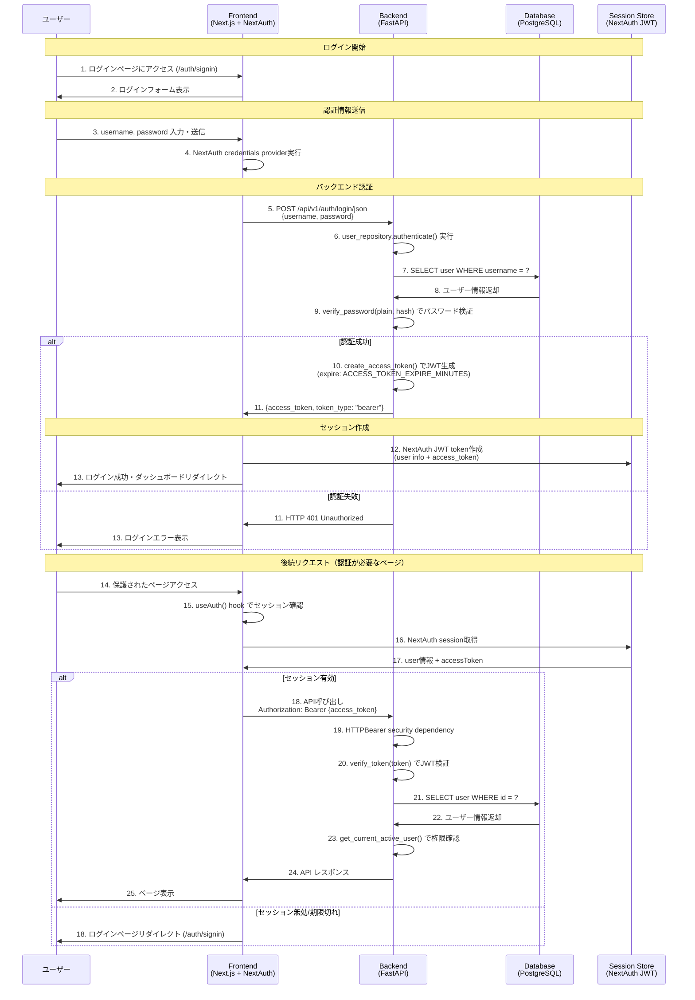

# ログインシーケンス図

## 概要

Knowledge Revision Approval Systemのログイン処理のシーケンス図です。
システムはNext.js (Frontend) + FastAPI (Backend) + PostgreSQL (Database)の構成で、NextAuth.jsとJWT認証を使用しています。

## ログインシーケンス

## 主要コンポーネント

### Frontend (Next.js + NextAuth)
- **NextAuth Configuration** (`/app/api/auth/[...nextauth]/route.ts`)
  - CredentialsProvider でユーザー名・パスワード認証
  - JWT戦略でセッション管理
  - バックエンドAPI(`/api/v1/auth/login`)への認証要求

- **Authentication Hook** (`/src/hooks/use-auth.ts`)
  - `useSession()`をラップしたカスタムフック
  - ユーザー情報、認証状態、アクセストークンを提供

- **Protected Route** (`/src/components/auth/protected-route.tsx`)
  - 認証状態チェック
  - 役割ベースアクセス制御 (RBAC)
  - 承認グループベースアクセス制御

### Backend (FastAPI)
- **Auth Endpoints** (`/app/api/v1/endpoints/auth.py`)
  - `POST /login`: OAuth2形式ログイン (form-data)
  - `POST /login/json`: JSON形式ログイン
  - `GET /me`: 現在のユーザー情報取得
  - `POST /test-token`: トークン検証

- **Security Module** (`/app/core/security.py`)
  - `create_access_token()`: JWT生成
  - `verify_token()`: JWT検証
  - `verify_password()`: bcryptパスワード検証
  - `get_password_hash()`: パスワードハッシュ化

- **Dependencies** (`/app/api/dependencies.py`)
  - `get_current_user()`: JWTからユーザー取得
  - `get_current_active_user()`: アクティブユーザー確認
  - `get_current_approver_user()`: 承認者権限確認
  - `get_current_admin_user()`: 管理者権限確認

- **User Repository** (`/app/repositories/user.py`)
  - `authenticate()`: ユーザー名・パスワード認証
  - `create_with_password()`: パスワードハッシュ化してユーザー作成

### Database (PostgreSQL)
- **users テーブル**
  - id (UUID, Primary Key)
  - username (Unique)
  - email (Unique)
  - password_hash (bcrypt)
  - role (user/approver/admin)
  - approval_group_id (Foreign Key)
  - is_active (Boolean)

## 認証フロー特徴

1. **ハイブリッド認証**: NextAuth (Frontend) + JWT (Backend)
2. **役割ベースアクセス制御**: user, approver, admin の3つの役割
3. **承認グループベースアクセス制御**: 承認グループ単位でのアクセス制限
4. **セキュア実装**: bcrypt + JWT + HTTPSのみアクセス
5. **セッション管理**: NextAuth JWT戦略でステートレス
6. **トークン期限**: 設定可能 (ACCESS_TOKEN_EXPIRE_MINUTES)

## エラーハンドリング

- **401 Unauthorized**: 認証情報が無効
- **400 Bad Request**: 非アクティブユーザー
- **403 Forbidden**: 権限不足
- 自動的にログインページリダイレクト