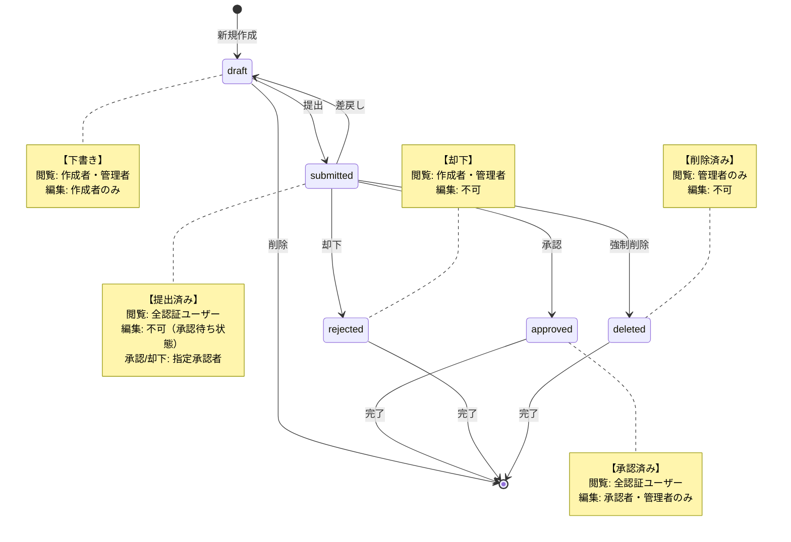

# 修正案ワークフロー詳細図

## 1. 状態遷移図（APIエンドポイント・権限付き）



## 状態遷移詳細

### 各遷移のAPI情報

| 遷移 | APIエンドポイント | メソッド | 権限 | 実行者 |
|------|------------------|----------|------|--------|
| **新規作成 → draft** | `/api/v1/proposals/` | POST | 認証済みユーザー | 提案者 |
| **draft内で編集** | `/api/v1/proposals/{id}` | PUT | 提案者本人 | 提案者 |
| **draft → submitted** | `/api/v1/proposals/{id}/submit` | POST | 提案者本人 | 提案者 |
| **submitted → approved** | `/api/v1/approvals/{id}/decide` | POST | 指定承認者 | 承認者 |
| **submitted → rejected** | `/api/v1/approvals/{id}/decide` | POST | 指定承認者 | 承認者 |
| **submitted → draft** | `/api/v1/proposals/{id}/withdraw` | POST | 提案者本人 | 提案者 |
| **submitted → deleted** | `/api/v1/revisions/{id}/status` | PATCH | 管理者のみ | 管理者 |
| **draft → 削除** | `/api/v1/proposals/{id}` | DELETE | 提案者本人 | 提案者 |

### 承認・却下時のリクエストボディ

**承認の場合:**
```json
{
  "action": "approve",
  "comment": "承認コメント",
  "priority": "medium"
}
```

**却下の場合:**
```json
{
  "action": "reject", 
  "comment": "却下理由",
  "priority": "low"
}
```

## 2. 権限マトリックス表

### 2.1 状態別閲覧権限

| 状態 | 管理者<br>(Admin) | 承認者<br>(Approver) | 一般ユーザー<br>(User) | 作成者本人<br>(Owner) |
|------|------------------|---------------------|----------------------|---------------------|
| **draft**<br>（下書き） | ✓ | ✗ | ✗ | ✓ |
| **submitted**<br>（提出済み） | ✓ | ✓ | ✓ | ✓ |
| **approved**<br>（承認済み） | ✓ | ✓ | ✓ | ✓ |
| **rejected**<br>（却下） | ✓ | ✗ | ✗ | ✓ |
| **deleted**<br>（削除済み） | ✓ | ✗ | ✗ | ✗ |

### 2.2 操作別実行権限

| 操作 | APIエンドポイント | 必要な権限 | 前提条件 |
|------|------------------|-----------|----------|
| **作成** | `POST /api/v1/proposals/` | 認証済みユーザー | なし |
| **更新** | `PUT /api/v1/proposals/{id}` | 提案者本人 | status = draft |
| **承認済み更新** | `PUT /api/v1/proposals/{id}/approved-update` | 指定承認者・管理者 | status = approved |
| **汎用更新** | `PUT /api/v1/revisions/{id}` | 提案者本人 or 指定承認者・管理者 | status = draft or approved（submitted不可） |
| **提出** | `POST /api/v1/proposals/{id}/submit` | 提案者本人 | status = draft |
| **撤回** | `POST /api/v1/proposals/{id}/withdraw` | 提案者本人 | status = submitted |
| **承認** | `POST /api/v1/approvals/{id}/decide` | 指定承認者 | status = submitted |
| **却下** | `POST /api/v1/approvals/{id}/decide` | 指定承認者 | status = submitted |
| **削除** | `DELETE /api/v1/proposals/{id}` | 提案者本人 | status = draft |
| **強制削除** | `PATCH /api/v1/revisions/{id}/status` | 管理者のみ | status = submitted |

## 3. API詳細一覧

### 3.1 修正案作成・編集系API

#### POST /api/v1/proposals/
- **目的**: 新規修正案の作成
- **権限**: 認証済みユーザー
- **初期状態**: draft
- **必須フィールド**:
  - `target_article_id`: 対象記事ID
  - `approver_id`: 承認者ID（必須）
  - `reason`: 修正理由
  - `after_*`: 少なくとも1つの変更フィールド

#### PUT /api/v1/proposals/{proposal_id}
- **目的**: 修正案の更新（draft状態のみ）
- **権限**: 提案者本人
- **制約**: status = draft のみ
- **更新可能**: すべてのafter_*フィールド、reason、approver_id

#### PUT /api/v1/proposals/{proposal_id}/approved-update
- **目的**: 承認済み修正案の更新
- **権限**: 指定承認者または管理者
- **制約**: status = approved のみ
- **更新可能**: すべてのafter_*フィールド、reason（コアメタデータ除く）
- **保護フィールド**: status、proposer_id、approver_id
- **副作用**: processed_at更新、提案者への通知送信

#### PUT /api/v1/revisions/{revision_id}
- **目的**: 汎用修正案更新（状態別権限制御）
- **権限**: 
  - draft: 提案者本人のみ
  - approved: 指定承認者または管理者のみ
  - submitted: 編集不可（承認待ち状態のため）
- **制約**: draft または approved のみ（submitted, rejected, deleted は不可）
- **更新可能**: すべてのafter_*フィールド、reason
- **approved時保護**: status フィールドは自動で NULL 設定

#### DELETE /api/v1/proposals/{proposal_id}
- **目的**: 修正案の削除
- **権限**: 提案者本人
- **制約**: status = draft のみ
- **結果**: 物理削除

### 3.2 ワークフロー系API

#### POST /api/v1/proposals/{proposal_id}/submit
- **目的**: 修正案を承認待ちに変更
- **権限**: 提案者本人
- **状態遷移**: draft → submitted
- **副作用**: 承認者への通知送信

#### POST /api/v1/proposals/{proposal_id}/withdraw
- **目的**: 提出済み修正案を下書きに戻す
- **権限**: 提案者本人
- **状態遷移**: submitted → draft
- **用途**: 修正が必要な場合の差戻し

#### POST /api/v1/approvals/{revision_id}/decide
- **目的**: 修正案の承認・却下
- **権限**: 指定された承認者
- **リクエストボディ**:
```json
{
  "action": "approve|reject|request_changes|defer",
  "comment": "承認コメント",
  "priority": "low|medium|high|urgent"
}
```
- **状態遷移**:
  - approve: submitted → approved
  - reject: submitted → rejected
  - request_changes: 状態維持（コメント追加）
  - defer: 状態維持（優先度変更）

#### PATCH /api/v1/revisions/{revision_id}/status
- **目的**: ステータスの直接変更（管理者用）
- **権限**: 管理者のみ
- **リクエストボディ**:
```json
{
  "status": "submitted|approved|rejected|deleted"
}
```
- **用途**: 緊急時の強制状態変更

### 3.3 閲覧系API

#### GET /api/v1/revisions/
- **目的**: 修正案一覧取得
- **権限**: 認証済みユーザー
- **返却内容**:
  - 管理者: すべての修正案
  - 一般ユーザー: 公開修正案（submitted/approved）+ 自分の非公開修正案（draft/rejected）

#### GET /api/v1/revisions/{revision_id}
- **目的**: 修正案詳細取得
- **権限**: 
  - 公開修正案（submitted/approved）: 全認証ユーザー
  - 非公開修正案（draft/rejected）: 作成者と管理者のみ

#### GET /api/v1/revisions/by-article/{target_article_id}
- **目的**: 特定記事の修正履歴取得
- **権限**: 全認証ユーザー
- **返却内容**: 公開修正案（submitted/approved）のみ
- **用途**: 記事の変更履歴表示、類似修正案の参考

## 4. 典型的な使用シナリオ

### 4.1 通常の承認フロー
```
1. ユーザーが修正案を作成（draft）
   POST /api/v1/proposals/
   
2. 内容を編集・調整（draft）
   PUT /api/v1/proposals/{id}
   
3. 承認者に提出（draft → submitted）
   POST /api/v1/proposals/{id}/submit
   
4. 承認者が内容を確認して承認（submitted → approved）
   POST /api/v1/approvals/{id}/decide
   {"action": "approve"}
```

### 4.1.1 承認後の編集フロー（新機能）
```
5. 承認者が承認済み修正案を軽微修正（approved状態を維持）
   PUT /api/v1/proposals/{id}/approved-update
   {"after_title": "軽微な修正"}
   
   または
   
   PUT /api/v1/revisions/{id}
   {"after_title": "軽微な修正"}
   
6. 提案者に編集完了の通知が送信される
```

### 4.2 差戻しフロー
```
1. 提出済み修正案に問題を発見
   
2. 提案者が撤回（submitted → draft）
   POST /api/v1/proposals/{id}/withdraw
   
3. 内容を修正（draft）
   PUT /api/v1/proposals/{id}
   
4. 再提出（draft → submitted）
   POST /api/v1/proposals/{id}/submit
```

### 4.3 却下フロー
```
1. 承認者が修正案を確認
   
2. 内容が不適切と判断して却下（submitted → rejected）
   POST /api/v1/approvals/{id}/decide
   {"action": "reject", "comment": "却下理由"}
   
3. 却下された修正案は作成者のみ閲覧可能
   （他ユーザーからは見えない）
```

### 4.4 管理者による強制削除
```
1. 不適切な内容の修正案を発見
   
2. 管理者が強制削除（submitted → deleted）
   PATCH /api/v1/revisions/{id}/status
   {"status": "deleted"}
   
3. 削除後は管理者のみ閲覧可能
```

## 5. セキュリティ考慮事項

### 5.1 権限チェックの実装
- **JWT認証**: すべてのAPIでBearer tokenによる認証が必要
- **ロールベース制御**: user/approver/adminの3段階
- **所有者チェック**: 作成者本人かどうかの確認
- **状態チェック**: 操作可能な状態かどうかの確認
- **承認者制限**: approved修正案は指定承認者(approver_id)のみ編集可能

### 5.2 データ保護
- **非公開情報の保護**: draft/rejectedは作成者と管理者のみアクセス可能
- **削除データの隔離**: deletedは管理者のみアクセス可能
- **承認者の制限**: approver_idで指定された承認者のみが承認可能
- **コアメタデータ保護**: approved修正案編集時にstatus、proposer_id、approver_idの変更を防止
- **編集証跡**: approved修正案編集時にprocessed_at更新と通知送信で監査証跡を維持

### 5.3 監査証跡
- **タイムスタンプ**: created_at, updated_at, processed_at
- **実行者記録**: proposer_id, approver_id
- **状態履歴**: 通知システムによる変更履歴の記録

## 6. パフォーマンス最適化

### 6.1 クエリ最適化
- **インデックス**: status, proposer_id, approver_id, target_article_id
- **ページネーション**: skip/limitパラメータによる制御
- **選択的取得**: 必要なフィールドのみ取得

### 6.2 キャッシュ戦略（将来実装）
- **公開修正案**: Redisによるキャッシュ
- **統計情報**: 定期的な集計とキャッシュ
- **権限情報**: セッション単位でのキャッシュ

## 7. エラーハンドリング

### 7.1 一般的なエラー
- **401 Unauthorized**: 認証なし
- **403 Forbidden**: 権限不足
- **404 Not Found**: リソース不存在
- **409 Conflict**: 状態競合

### 7.2 カスタム例外
- **ProposalNotFoundError**: 修正案が見つからない
- **ProposalPermissionError**: 修正案への権限なし
- **ProposalStatusError**: 不正な状態遷移
- **ApprovalPermissionError**: 承認権限なし

## 8. 実装済み新機能（2025年1月）

### 8.1 承認済み修正案の編集機能
- **機能概要**: 承認者が承認済み修正案を直接編集可能
- **対象ユーザー**: 指定承認者(approver_id)または管理者のみ
- **利用シーン**: 承認後の軽微な修正、補完情報の追加、誤字脱字の修正
- **セキュリティ**: コアメタデータ保護、編集証跡記録、通知送信

### 8.2 API拡張
- **専用エンドポイント**: `PUT /api/v1/proposals/{id}/approved-update`
- **汎用エンドポイント拡張**: `PUT /api/v1/revisions/{id}` で状態別権限制御
- **権限分離**: draft編集(提案者)とapproved編集(承認者)の明確な分離
- **submitted状態**: 編集不可を維持（承認待ち状態の整合性保護）

### 8.3 通知システム連携
- **自動通知**: 承認済み修正案編集時に提案者への通知送信
- **編集証跡**: processed_at フィールド更新で変更履歴を記録
- **失敗時制御**: 通知送信失敗時も編集処理は成功継続

## 9. 今後の拡張予定

### 9.1 ワークフロー拡張
- **多段階承認**: 複数の承認者による順次承認
- **条件付き承認**: 特定条件での自動承認
- **期限管理**: 承認期限の設定と通知

### 9.2 権限拡張
- **部門別アクセス制御**: 承認グループごとの閲覧制限
- **委任機能**: 承認権限の一時委任
- **カスタムロール**: 組織固有の権限設定

### 9.3 機能拡張
- **バージョン管理**: 修正案の履歴管理
- **コメント機能**: 修正案へのコメント追加
- **添付ファイル**: 参考資料の添付機能