# KSAP フロントエンド アーキテクチャ設計

## 🎯 設計方針とMVP戦略

### ビジネス要件
- **年間処理件数**: 10,000件のメンテナンス提案
- **重要課題**: 承認作業の効率化
- **優先機能**: 差分理解 + 判定速度の両立

### MVP方針
- **基本的だが確実に動作**する機能セット
- 軽量版差分表示機能
- 将来の高機能化への拡張性を保持

## 🏗️ システムアーキテクチャ

### 技術スタック

#### フロントエンドスタック
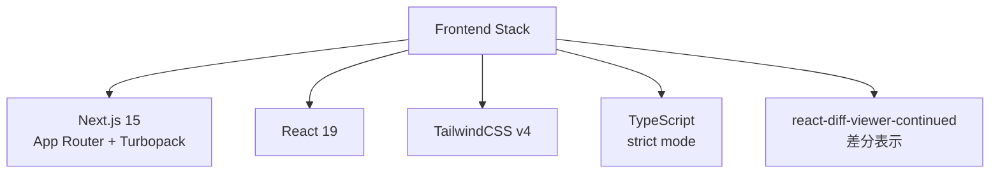

#### バックエンド統合
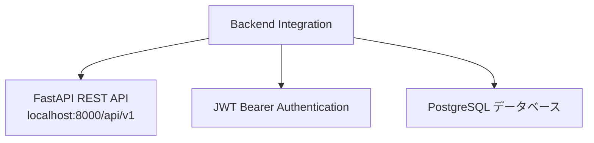

### ページ構成とルーティング

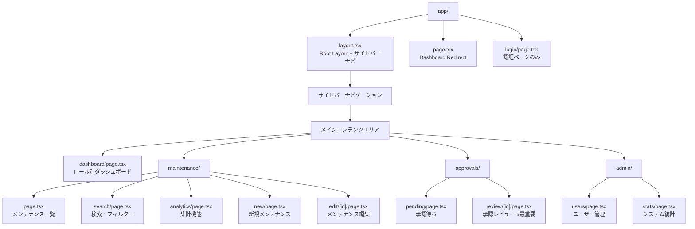

#### サイドバーナビゲーション構成
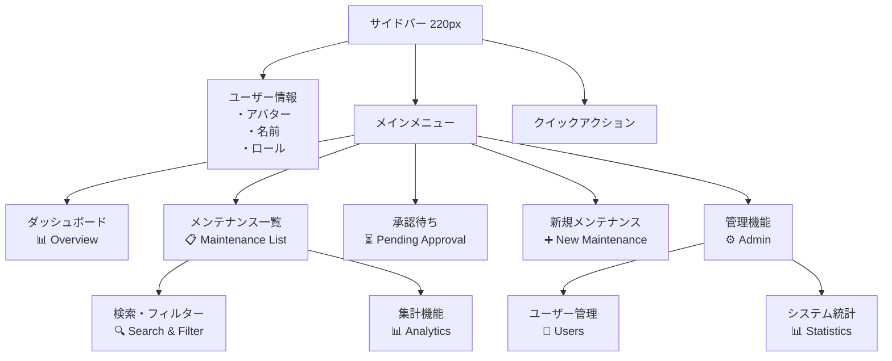

## 🎨 承認レビューページ設計 (核心機能)

### レイアウト構成

#### サイドバーナビゲーション + メインコンテンツ
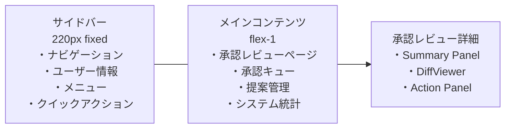

#### 承認レビューページ内部構成
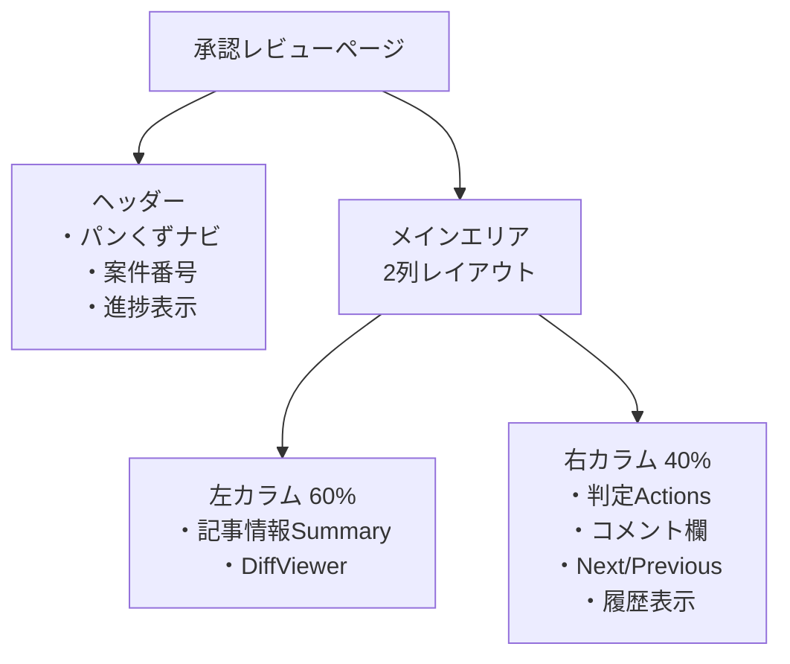

#### レスポンシブ対応
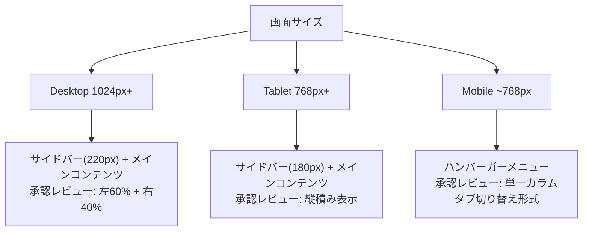

### データフロー

#### ページ読み込み処理
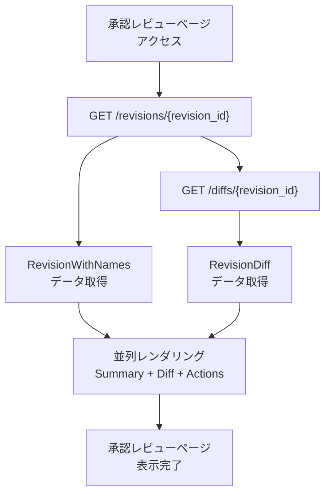

#### 判定処理フロー
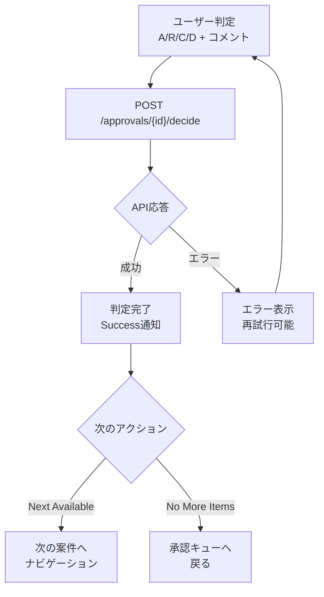

## 🚀 開発フェーズ計画

### 開発タイムライン
```mermaid
gantt
    title KSAP フロントエンド開発スケジュール
    dateFormat X
    axisFormat %s
    
    section Phase 1: 基盤
    JWT認証システム           :done, p1a, 0, 3d
    ロール別ダッシュボード      :done, p1b, after p1a, 2d
    基本ナビゲーション         :done, p1c, after p1b, 2d
    AuthGuard実装            :done, p1d, after p1c, 1d
    
    section Phase 2: 承認ワークフロー ⭐
    承認キュー画面            :active, p2a, after p1d, 3d
    承認レビューページ         :p2b, after p2a, 4d
    差分表示コンポーネント      :p2c, after p2b, 3d
    判定アクション機能         :p2d, after p2c, 2d
    ナビゲーション機能         :p2e, after p2d, 2d
    
    section Phase 3: 提案管理
    提案作成フォーム          :p3a, after p2e, 4d
    提案一覧・編集機能         :p3b, after p3a, 3d
    自分の提案管理            :p3c, after p3b, 2d
    
    section Phase 4: 管理・最適化
    通知システム              :p4a, after p3c, 2d
    管理者機能               :p4b, after p4a, 3d
    パフォーマンス最適化       :p4c, after p4b, 2d
    エラーハンドリング強化     :p4d, after p4c, 1d
```

### フェーズ詳細

#### Phase 1: 認証・ナビゲーション基盤 (Week 1-2)
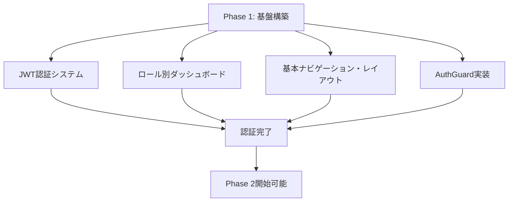

#### Phase 2: 承認ワークフロー (Week 3-4) ⭐最重要
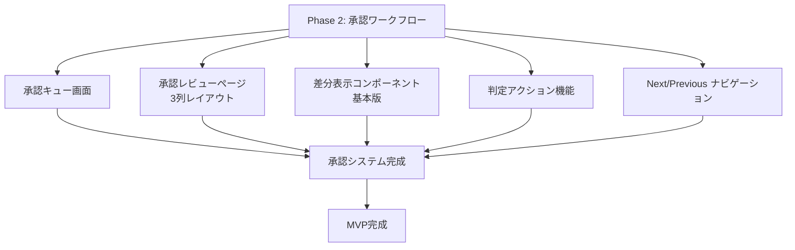

## 📊 ユーザーロール別機能マトリクス

### 機能アクセス権限図
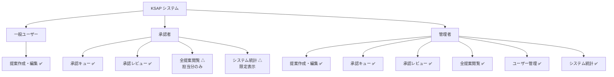

### 権限マトリクス表
| 機能 | 一般ユーザー | 承認者 | 管理者 |
|------|-------------|-------|-------|
| 提案作成・編集 | ✅ | ❌ | ✅ |
| 承認キュー | ❌ | ✅ | ✅ |
| 承認レビュー | ❌ | ✅ | ✅ |
| 全提案閲覧 | ❌ | △(担当分) | ✅ |
| ユーザー管理 | ❌ | ❌ | ✅ |
| システム統計 | ❌ | △(限定) | ✅ |

## 🔧 技術的制約・前提条件

### パフォーマンス要件
- 承認レビューページの初期表示: 3秒以内
- 判定処理: 1秒以内
- UI操作応答: 100ms以内

### ブラウザサポート
- Chrome 90+
- Firefox 88+
- Safari 14+
- Edge 90+

### アクセシビリティ
- WCAG 2.1 AA準拠
- キーボードナビゲーション完全対応
- スクリーンリーダー対応

## 📈 将来の拡張性

### 高機能化ロードマップ
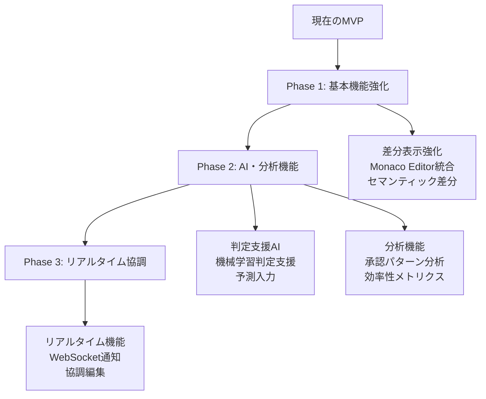

### 技術スケーラビリティ
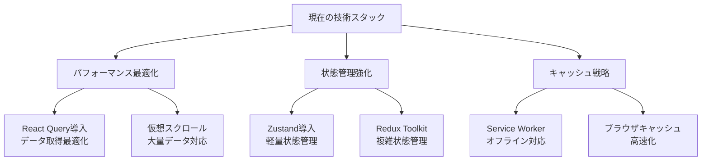