# KSAP フロントエンド アーキテクチャ設計

## 🎯 設計方針とMVP戦略

### ビジネス要件
- **年間処理件数**: 10,000件の改訂提案
- **重要課題**: 承認作業の効率化
- **優先機能**: 差分理解 + 判定速度の両立

### MVP方針
- **基本的だが確実に動作**する機能セット
- 軽量版差分表示機能
- 将来の高機能化への拡張性を保持

## 🏗️ システムアーキテクチャ

### 技術スタック

#### フロントエンドスタック


#### バックエンド統合
```mermaid
graph TD
    G[Backend Integration] --> H[FastAPI REST API<br/>localhost:8000/api/v1]
    G --> I[JWT Bearer Authentication]
    G --> J[PostgreSQL データベース]
```

### ページ構成とルーティング

```mermaid
graph TD
    A[app/] --> B[layout.tsx<br/>Root Layout + 認証]
    A --> C[page.tsx<br/>Dashboard Redirect]
    A --> D[login/page.tsx]
    A --> E[dashboard/page.tsx<br/>ロール別分岐]
    
    A --> F[approvals/]
    F --> G[queue/page.tsx<br/>承認キュー]
    F --> H["review/[id]/page.tsx<br/>承認レビュー ⭐最重要"]
    F --> I[history/page.tsx<br/>承認履歴]
    
    A --> J[proposals/]
    J --> K[new/page.tsx<br/>新規提案]
    J --> L[my/page.tsx<br/>自分の提案]
    J --> M["edit/[id]/page.tsx<br/>提案編集"]
    
    A --> N[admin/]
    N --> O[users/page.tsx<br/>ユーザー管理]
    N --> P[stats/page.tsx<br/>システム統計]
```

## 🎨 承認レビューページ設計 (核心機能)

### レイアウト構成

#### デスクトップレイアウト（3列グリッド）
```mermaid
flowchart LR
    A[Summary<br/>1/4 width<br/>・記事情報<br/>・提案者<br/>・重要度<br/>・変更統計] --- B[DiffViewer<br/>2/4 width<br/>・Before/After<br/>・変更ハイライト<br/>・フィールド別表示<br/>・critical強調] --- C[Actions<br/>1/4 width<br/>・判定ボタン<br/>・コメント欄<br/>・操作ガイド<br/>・ナビゲーション]
```

#### レスポンシブ対応
```mermaid
graph TD
    D[画面サイズ] --> E[Desktop 1024px+]
    D --> F[Tablet 768px+]
    D --> G[Mobile ~768px]
    
    E --> H[3列グリッド<br/>Summary | DiffViewer | Actions]
    F --> I[2列グリッド<br/>Diff+Actions | Summary]
    G --> J[縦スタック<br/>Summary<br/>↓<br/>DiffViewer<br/>↓<br/>Actions]
```

### データフロー

#### ページ読み込み処理
```mermaid
graph TD
    A[承認レビューページ<br/>アクセス] --> B["GET /revisions/{revision_id}"]
    B --> C[RevisionWithNames<br/>データ取得]
    B --> D["GET /diffs/{revision_id}"]
    D --> E[RevisionDiff<br/>データ取得]
    C --> F[並列レンダリング<br/>Summary + Diff + Actions]
    E --> F
    F --> G[承認レビューページ<br/>表示完了]
```

#### 判定処理フロー
```mermaid
graph TD
    H[ユーザー判定<br/>A/R/C/D + コメント] --> I["POST /approvals/{id}/decide"]
    I --> J{API応答}
    J -->|成功| K[判定完了<br/>Success通知]
    J -->|エラー| L[エラー表示<br/>再試行可能]
    K --> M{次のアクション}
    M -->|Next Available| N[次の案件へ<br/>ナビゲーション]
    M -->|No More Items| O[承認キューへ<br/>戻る]
    L --> H
```

## 🚀 開発フェーズ計画

### 開発タイムライン
```mermaid
gantt
    title KSAP フロントエンド開発スケジュール
    dateFormat X
    axisFormat %s
    
    section Phase 1: 基盤
    JWT認証システム           :done, p1a, 0, 3d
    ロール別ダッシュボード      :done, p1b, after p1a, 2d
    基本ナビゲーション         :done, p1c, after p1b, 2d
    AuthGuard実装            :done, p1d, after p1c, 1d
    
    section Phase 2: 承認ワークフロー ⭐
    承認キュー画面            :active, p2a, after p1d, 3d
    承認レビューページ         :p2b, after p2a, 4d
    差分表示コンポーネント      :p2c, after p2b, 3d
    判定アクション機能         :p2d, after p2c, 2d
    ナビゲーション機能         :p2e, after p2d, 2d
    
    section Phase 3: 提案管理
    提案作成フォーム          :p3a, after p2e, 4d
    提案一覧・編集機能         :p3b, after p3a, 3d
    自分の提案管理            :p3c, after p3b, 2d
    
    section Phase 4: 管理・最適化
    通知システム              :p4a, after p3c, 2d
    管理者機能               :p4b, after p4a, 3d
    パフォーマンス最適化       :p4c, after p4b, 2d
    エラーハンドリング強化     :p4d, after p4c, 1d
```

### フェーズ詳細

#### Phase 1: 認証・ナビゲーション基盤 (Week 1-2)
```mermaid
graph TD
    A[Phase 1: 基盤構築] --> B[JWT認証システム]
    A --> C[ロール別ダッシュボード]
    A --> D[基本ナビゲーション・レイアウト]
    A --> E[AuthGuard実装]
    
    B --> F[認証完了]
    C --> F
    D --> F
    E --> F
    F --> G[Phase 2開始可能]
```

#### Phase 2: 承認ワークフロー (Week 3-4) ⭐最重要
```mermaid
graph TD
    H[Phase 2: 承認ワークフロー] --> I[承認キュー画面]
    H --> J[承認レビューページ<br/>3列レイアウト]
    H --> K[差分表示コンポーネント<br/>基本版]
    H --> L[判定アクション機能]
    H --> M[Next/Previous ナビゲーション]
    
    I --> N[承認システム完成]
    J --> N
    K --> N
    L --> N
    M --> N
    N --> O[MVP完成]
```

## 📊 ユーザーロール別機能マトリクス

### 機能アクセス権限図
```mermaid
graph TD
    A[KSAP システム] --> B[一般ユーザー]
    A --> C[承認者]
    A --> D[管理者]
    
    B --> E[提案作成・編集 ✅]
    
    C --> F[承認キュー ✅]
    C --> G[承認レビュー ✅]
    C --> H[全提案閲覧 △<br/>担当分のみ]
    C --> I[システム統計 △<br/>限定表示]
    
    D --> J[提案作成・編集 ✅]
    D --> K[承認キュー ✅]
    D --> L[承認レビュー ✅]
    D --> M[全提案閲覧 ✅]
    D --> N[ユーザー管理 ✅]
    D --> O[システム統計 ✅]
```

### 権限マトリクス表
| 機能 | 一般ユーザー | 承認者 | 管理者 |
|------|-------------|-------|-------|
| 提案作成・編集 | ✅ | ❌ | ✅ |
| 承認キュー | ❌ | ✅ | ✅ |
| 承認レビュー | ❌ | ✅ | ✅ |
| 全提案閲覧 | ❌ | △(担当分) | ✅ |
| ユーザー管理 | ❌ | ❌ | ✅ |
| システム統計 | ❌ | △(限定) | ✅ |

## 🔧 技術的制約・前提条件

### パフォーマンス要件
- 承認レビューページの初期表示: 3秒以内
- 判定処理: 1秒以内
- UI操作応答: 100ms以内

### ブラウザサポート
- Chrome 90+
- Firefox 88+
- Safari 14+
- Edge 90+

### アクセシビリティ
- WCAG 2.1 AA準拠
- キーボードナビゲーション完全対応
- スクリーンリーダー対応

## 📈 将来の拡張性

### 高機能化ロードマップ
```mermaid
graph TD
    A[現在のMVP] --> B[Phase 1: 基本機能強化]
    B --> C[Phase 2: AI・分析機能]
    C --> D[Phase 3: リアルタイム協調]
    
    B --> E[差分表示強化<br/>Monaco Editor統合<br/>セマンティック差分]
    
    C --> F[判定支援AI<br/>機械学習判定支援<br/>予測入力]
    C --> G[分析機能<br/>承認パターン分析<br/>効率性メトリクス]
    
    D --> H[リアルタイム機能<br/>WebSocket通知<br/>協調編集]
```

### 技術スケーラビリティ
```mermaid
graph TD
    I[現在の技術スタック] --> J[パフォーマンス最適化]
    I --> K[状態管理強化]
    I --> L[キャッシュ戦略]
    
    J --> M[React Query導入<br/>データ取得最適化]
    J --> N[仮想スクロール<br/>大量データ対応]
    
    K --> O[Zustand導入<br/>軽量状態管理]
    K --> P[Redux Toolkit<br/>複雑状態管理]
    
    L --> Q[Service Worker<br/>オフライン対応]
    L --> R[ブラウザキャッシュ<br/>高速化]
```